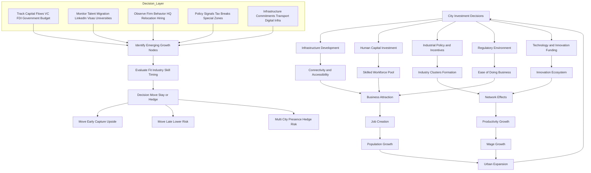

---
{"dg-publish":true,"permalink":"/js-sez/","dgPassFrontmatter":true,"noteIcon":"","created":"2026-04-24T08:14:49.389+08:00"}
---

```mermaid
flowchart TD

%% CORE DRIVER
A[City Investment Decisions] --> B[Infrastructure Development]
A --> C[Human Capital Investment]
A --> D[Industrial Policy and Incentives]
A --> E[Regulatory Environment]
A --> F[Technology and Innovation Funding]

%% FIRST ORDER EFFECTS
B --> G[Connectivity and Accessibility]
C --> H[Skilled Workforce Pool]
D --> I[Industry Clusters Formation]
E --> J[Ease of Doing Business]
F --> K[Innovation Ecosystem]

%% SECOND ORDER EFFECTS
G --> L[Business Attraction]
H --> L
I --> M[Network Effects]
J --> L
K --> M

%% ECONOMIC OUTCOMES
L --> N[Job Creation]
M --> O[Productivity Growth]
N --> P[Population Growth]
O --> Q[Wage Growth]

%% FEEDBACK LOOP
P --> R[Urban Expansion]
Q --> R
R --> A

%% DECISION LAYER
subgraph Decision_Layer
    S1[Track Capital Flows VC FDI Government Budget]
    S2[Monitor Talent Migration LinkedIn Visas Universities]
    S3[Observe Firm Behavior HQ Relocation Hiring]
    S4[Policy Signals Tax Breaks Special Zones]
    S5[Infrastructure Commitments Transport Digital Infra]
end

S1 --> T[Identify Emerging Growth Nodes]
S2 --> T
S3 --> T
S4 --> T
S5 --> T

T --> U[Evaluate Fit Industry Skill Timing]
U --> V[Decision Move Stay or Hedge]

%% STRATEGIC OPTIONS
V --> W1[Move Early Capture Upside]
V --> W2[Move Late Lower Risk]
V --> W3[Multi City Presence Hedge Risk]
```

![[Infonomics_Information Ecosystem.pdf]]

#development